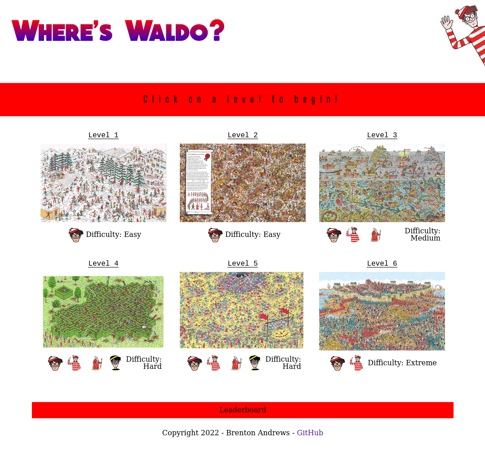
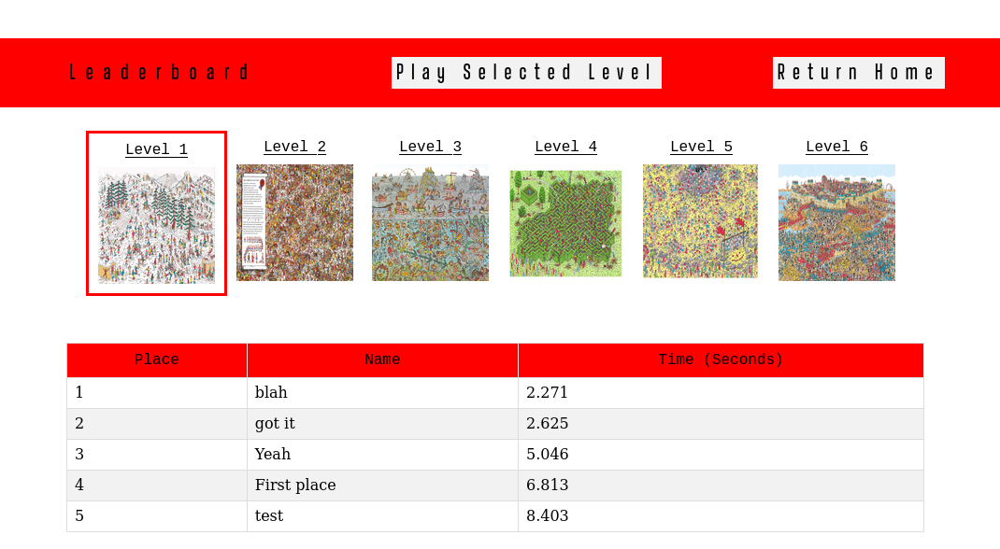

# React Where's Waldo!

View the project live [here](www.google.com).

-----

##### About this project.

Completed for [The Odin Project](https://www.theodinproject.com/lessons/node-path-javascript-where-s-waldo-a-photo-tagging-app).

This project served as an introduction to using Backend-as-a-Service via Firebase. My implementation of the game allows you to select a level, play the level
and submit your score (time in seconds) and username to a leaderboard stored in Firebase. 

The biggest issue with this project currently is that I couldn't find high quality images from Where's Waldo. Levels 4 and 6 are pretty much unplayable due 
to the low resolution of the images used but at this point I'm not worried about it.

-----

##### Frameworks

This project was built using React and Firebase Firestore.

-----

##### Takeaways

First up, I learned quite a bit about the lore of the Where's Waldo universe. I didn't even realize that Odlaw was Waldo's evil twin, 
or that Waldo is known as 'Wally' outside of North America.

Other (less important) things I learned were working with asynchronous data fetching with React, performing basic 'create' and 'read' operations 
on Firestore and Firebase security rules. 

-----

##### Todo

Possible future improvements:
- Improve Firestore security by updating the rule set, implement authentication. 
- Update game images for levels 4 and 6.
- Move some functionality to the BaaS for additional practice.
- Sanitize user name submissions for bad language / etc.
